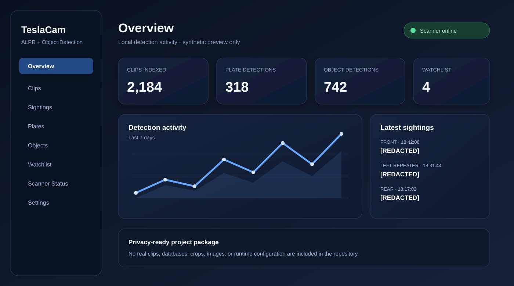
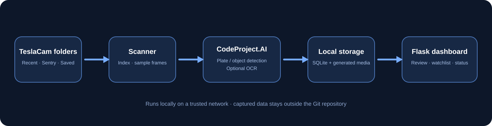

# Tesla License Plate Scanner | AI Dashboard for TeslaUSB & TeslaCam Footage
### Review Tesla Dashcam, Sentry Mode, and Saved Clip footage using the car's built-in cameras


A self-hosted, privacy-first dashboard for reviewing **TeslaCam footage already saved by a Tesla vehicle**. It indexes Dashcam, Sentry Mode, and Saved Clip video; detects visible license plates with a local CodeProject.AI endpoint; optionally uses OCR to read plate text; reduces duplicate sightings; and gives you one searchable dashboard for clips, plates, detections, objects, and scanner status.

> [!IMPORTANT]
> This project processes footage you already have permission to review. It is not a real-time surveillance system, does not access Tesla vehicle systems, does not identify vehicle owners, and does not include any government or commercial plate-lookup database.



---

## Table of Contents

- [What It Does](#what-it-does)
- [How It Works](#how-it-works)
- [Features](#features)
- [System Architecture](#system-architecture)
- [Requirements](#requirements)
- [Quick Start](#quick-start)
- [Configuration](#configuration)
- [CodeProject.AI Integration](#codeprojectai-integration)
- [Service Management](#service-management)
- [Development Run](#development-run)
- [Project Layout](#project-layout)
- [Privacy, Safety, and Responsible Use](#privacy-safety-and-responsible-use)
- [Known Limitations](#known-limitations)
- [Documentation](#documentation)

---


## TeslaUSB + TeslaCam Workflow

> **Turn Tesla’s built-in cameras into a searchable AI footage system.**

TeslaUSB runs on a Raspberry Pi and can act as the TeslaCam USB drive while automatically preserving and backing up Dashcam, Sentry Mode, and Saved Clip footage to attached storage.

This project is the **AI analysis layer**. It scans those saved TeslaCam-compatible folders, detects visible license plates, attempts OCR text extraction, reduces duplicate sightings, and turns raw camera footage into a searchable local dashboard.

```text
Tesla Built-In Cameras
        ↓
Tesla Dashcam / Sentry / Saved Clips
        ↓
TeslaUSB running on a Raspberry Pi
        ↓
TeslaCam folders saved to Pi storage, SSD, NAS, or backup drive
        ↓
Tesla License Plate Scanner
        ↓
AI Detection + OCR + Searchable Local Dashboard
```

### Built to work with TeslaUSB

TeslaUSB handles the always-on camera-storage and backup side of the setup. This project handles the intelligence side: reviewing footage, finding plate detections, reading likely text, grouping repeated sightings, and making everything searchable.

TeslaUSB is optional. The scanner can analyze any compatible TeslaCam folder, including:

- TeslaUSB backups from a Raspberry Pi
- A copied Tesla USB drive
- TeslaCam folders on an external SSD
- TeslaCam archives stored on a NAS
- Dashcam, Sentry Mode, or Saved Clip folders copied to a home server

## What It Does
Tesla vehicles can record surround-view video through Dashcam, Sentry Mode, and Saved Clips. Those recordings are useful after a parking-lot incident, a drive, a Sentry event, or simply when you need to review what happened around the vehicle. The downside is that one event can contain several video streams and hundreds of frames.

Tesla License Plate Scanner turns a local TeslaCam archive into a searchable review workspace. It is designed to help you work through already-recorded footage faster while keeping the data under your control.

### Core capabilities

- Indexes TeslaCam `RecentClips`, `SentryClips`, and `SavedClips` folders.
- Samples video frames at configurable intervals instead of processing every frame.
- Sends sampled frames to a local **CodeProject.AI** license-plate detector.
- Saves a plate crop, detection confidence, source camera, event time, and source clip reference.
- Optionally runs **Tesseract OCR** and/or **CodeProject.AI OCR** on detected plate regions.
- Reduces repeated sightings from nearby frames and related clips.
- Tracks general object detections separately from plate results when enabled.
- Stores its local metadata in SQLite and generated previews on your own storage.
- Provides a browser dashboard for clip review, plate search, sightings, watchlists, settings, status, and maintenance.
- Runs as separate web and scanner services through `systemd`.

---

## How It Works

### 1. Tesla records the footage

Tesla Dashcam, Sentry Mode, and Saved Clips save video to USB or a TeslaUSB-style storage device. Your available folders normally look similar to this:

```text
TeslaCam/
├── RecentClips/
├── SentryClips/
└── SavedClips/
```

The exact video files and camera availability vary by vehicle model, software version, recording mode, and event type.

### 2. The scanner indexes the TeslaCam archive

The background scanner looks at the configured TeslaCam root folder, finds compatible video clips, and samples frames from available camera streams. It can use a direct USB mount, a copied backup folder, an SSD archive, or a network-mounted TeslaCam folder.

### 3. Local AI looks for plate-shaped regions

Selected frames are sent to a **local CodeProject.AI** custom vision endpoint. The detector returns bounding boxes and confidence values for regions that appear to contain a license plate.

The scanner stores a review crop along with source details such as the camera label, timestamp, source clip, event folder, and detection confidence.

### 4. OCR can attempt to read plate text

When enabled, the scanner can process a plate crop with local Tesseract OCR or CodeProject.AI OCR. The extracted text is stored as a review aid alongside the original detection.

OCR is optional and should never be treated as perfect. Results can be affected by distance, glare, motion blur, weather, compression, angle, and plate design.

### 5. Nearby duplicates are reduced

A single vehicle may appear in several frames or across multiple Tesla cameras. The scanner uses available metadata such as plate text, time window, source clip, camera, detection position, and confidence to limit repeated entries.

### 6. The dashboard makes results reviewable

The Flask dashboard turns the local scan data into searchable pages. You can review a specific event, filter by camera, find a recognized plate string, inspect a detection crop, see linked clips, or check whether the scanner is running normally.



---

## Features

| Area | Included capabilities |
| --- | --- |
| **TeslaCam indexing** | Reads `RecentClips`, `SentryClips`, and `SavedClips`; keeps clip and event context; configurable scan interval and frame sampling. |
| **License-plate detection** | Local CodeProject.AI custom-model integration, configurable detector confidence threshold, local crops and metadata. |
| **OCR enrichment** | Optional Tesseract OCR and optional CodeProject.AI OCR, OCR confidence filtering, stored recognized text. |
| **Duplicate control** | Limits repeated entries from nearby frames, clips, and cameras to keep review results useful. |
| **Dashboard** | Responsive Flask interface with dashboard, clips, sightings, plates, objects, watchlist, status, and settings pages. |
| **Object tracking** | Optional general object-detection endpoint running alongside plate scanning. |
| **Local storage** | SQLite metadata database plus local generated previews; original source footage is left alone by default. |
| **Retention cleanup** | Configurable cleanup for generated images and old events. Source video deletion is disabled by default. |
| **Deployment** | Install script, safe configuration example, and paired `systemd` services for a web UI and background scanner. |

### Dashboard pages

| Page | Purpose |
| --- | --- |
| **Dashboard** | Recent activity, totals, scanner health, and quick navigation. |
| **Clips** | Browsable TeslaCam clip inventory with event context and linked detections. |
| **Sightings** | Time-ordered review view for all stored detections. |
| **Plates** | Searchable plate text, OCR confidence, crops, and appearance history. |
| **Plate Detail** | Timeline, associated images, related clips, and camera breakdown for a specific plate entry. |
| **Objects** | Optional general object detections separate from plate-specific results. |
| **Watchlist** | Local plate-text entries you want flagged for later review. |
| **Scanner Status** | Current scan state, last pass timing, counts, and errors. |
| **Settings** | Runtime thresholds, OCR controls, retention controls, and endpoint configuration. |

---

## System Architecture

The project is split into two local services that share a SQLite database:

```text
TeslaCam video archive
        │
        â–¼
Background scanner
  - indexes clips
  - samples frames
  - sends frames to AI
  - optional OCR
  - saves local metadata/crops
        │
        ├──────────────► Local CodeProject.AI
        │                 - custom plate detector
        │                 - optional object detector
        │                 - optional OCR endpoint
        â–¼
SQLite database + generated image previews
        │
        â–¼
Flask / Waitress dashboard on port 5057
```

The scanner and web app use SQLite in WAL mode so normal local reads can happen while the scan process stores new results.

---

## Requirements

### Recommended hardware

This project runs best on a Linux machine that stays powered on and has access to your TeslaCam footage.

A Raspberry Pi 5, small Intel/AMD mini PC, home server, or other multi-core Linux host is recommended for larger archives. Plate detection itself is performed by your CodeProject.AI instance, so the hardware needed also depends on where that AI service runs.

### Required components

- Linux host, Raspberry Pi, or similar always-on local machine.
- Python 3 and `python3-venv`.
- `ffmpeg` for video work.
- `python3-opencv` for frame handling.
- A mounted or copied TeslaCam archive.
- A reachable CodeProject.AI installation with a compatible custom license-plate model.
- Optional: `tesseract-ocr` for local OCR.

### Packages installed by `install.sh`

```text
python3
python3-venv
python3-pip
python3-opencv
tesseract-ocr
ffmpeg
rsync
```

---

## Quick Start

### 1. Clone the repository

```bash
git clone https://github.com/prokyle123/tesla-license-plate-scanner.git
cd tesla-license-plate-scanner
```

### 2. Run the installer

```bash
sudo bash install.sh
```

The installer deploys the project to:

```text
/opt/teslacam-plate-dashboard
```

It creates a safe local configuration file at:

```text
/opt/teslacam-plate-dashboard/config.json
```

### 3. Set your TeslaCam location and local AI endpoint

```bash
sudo nano /opt/teslacam-plate-dashboard/config.json
```

At a minimum, set the TeslaCam root path and make sure the CodeProject.AI URL and model name match your setup.

### 4. Restart the services

```bash
sudo systemctl restart teslacam-plate-web.service
sudo systemctl restart teslacam-plate-scanner.service
```

### 5. Open the dashboard

From a trusted device on your local network:

```text
http://YOUR-HOST-IP:5057
```

---

## Configuration

Start from the included safe-to-share example:

```bash
cp config.example.json config.json
```

Example:

```json
{
  "app": {
    "host": "0.0.0.0",
    "port": 5057
  },
  "paths": {
    "teslacam_root": "/mnt/gadget/part1-ro/TeslaCam",
    "db_path": "/opt/teslacam-plate-dashboard/data/plates.db",
    "static_dir": "/opt/teslacam-plate-dashboard/static"
  },
  "scanner": {
    "folders": ["RecentClips", "SentryClips", "SavedClips"],
    "scan_sleep_s": 60,
    "max_videos_per_pass": 40,
    "frame_interval_s": 2,
    "cpai_base_url": "http://127.0.0.1:32168",
    "cpai_model": "license-plate",
    "cpai_min_det_conf": 0.05,
    "ocr_enabled": false,
    "ocr_cpai_enabled": false,
    "object_detection_enabled": true,
    "generated_retention_days": 14,
    "event_retention_days": 30,
    "delete_source_clips": false
  }
}
```

### Important settings

| Setting | Meaning |
| --- | --- |
| `paths.teslacam_root` | Folder that contains your `TeslaCam` clip folders. |
| `scanner.scan_sleep_s` | Seconds the scanner waits between passes. |
| `scanner.max_videos_per_pass` | Maximum video files handled in one scan pass. |
| `scanner.frame_interval_s` | Sampling interval for plate detection. Smaller values mean more frames and more work. |
| `scanner.cpai_base_url` | Address of your CodeProject.AI server, normally local port `32168`. |
| `scanner.cpai_model` | Custom CodeProject.AI model name used by the plate detector. |
| `scanner.cpai_min_det_conf` | Minimum plate-detection confidence to keep. |
| `scanner.ocr_enabled` | Enables local Tesseract OCR. |
| `scanner.ocr_cpai_enabled` | Enables OCR through CodeProject.AI. |
| `scanner.object_detection_enabled` | Enables optional general object detections. |
| `scanner.generated_retention_days` | Days to retain generated crops and frames before cleanup. |
| `scanner.delete_source_clips` | Leave this `false` unless you intentionally want source video cleanup behavior. |

> [!WARNING]
> `config.json` is intentionally ignored by Git. Keep API keys, internal IP addresses, personal paths, and any runtime settings out of commits.

---

## CodeProject.AI Integration

This repository does **not** bundle CodeProject.AI or a custom plate model. You must run or access a compatible local CodeProject.AI installation separately.

The configured custom plate endpoint follows this pattern:

```text
http://YOUR-CPAI-HOST:32168/v1/vision/custom/license-plate
```

With the default example configuration:

```json
{
  "cpai_base_url": "http://127.0.0.1:32168",
  "cpai_model": "license-plate"
}
```

The scanner calls the local custom endpoint using the configured model name. General object detection is separately configurable and normally uses:

```text
/v1/vision/detection
```

---

## Service Management

### Check status

```bash
sudo systemctl status teslacam-plate-web.service --no-pager -l
sudo systemctl status teslacam-plate-scanner.service --no-pager -l
```

### Follow live logs

```bash
sudo journalctl -u teslacam-plate-web.service -f
sudo journalctl -u teslacam-plate-scanner.service -f
```

### Restart after a configuration change

```bash
sudo systemctl restart teslacam-plate-web.service
sudo systemctl restart teslacam-plate-scanner.service
```

### Start or stop the paired services

```bash
sudo systemctl start teslacam-plate.target
sudo systemctl stop teslacam-plate.target
```

### Disable automatic startup

```bash
sudo systemctl disable --now teslacam-plate.target
```

---

## Development Run

For a local development setup without installing `systemd` services:

```bash
cp config.example.json config.json
python3 -m venv venv
. venv/bin/activate
pip install -r requirements.txt
```

Start the web app in one terminal:

```bash
python -m app.webapp --config config.json
```

Start the scanner in another terminal:

```bash
. venv/bin/activate
python -m scanner.run_scanner --config config.json
```

Open:

```text
http://127.0.0.1:5057
```

---

## Project Layout

```text
tesla-license-plate-scanner/
├── app/                    # Flask app, database, local storage, video helpers, web routes
├── scanner/                # Frame sampling, CodeProject.AI client, OCR, deduplication, scan loop
├── templates/              # Dashboard HTML templates
├── static/                 # CSS, JavaScript, and local generated detection media
├── systemd/                # Web service, scanner service, paired target
├── tools/                  # Maintenance utilities, including OCR backfill
├── docs/                   # Architecture, deployment, and privacy notes
├── config.example.json     # Safe example configuration
├── install.sh              # Linux installation helper
└── requirements.txt        # Python dependencies
```

---

## Privacy, Safety, and Responsible Use

The project is intentionally local-first. The cleaned public repository does **not** contain:

- TeslaCam footage.
- Captured plate images.
- Live SQLite databases.
- Personal machine configuration.
- Vehicle-owner lookup tools.
- Government or commercial license-plate databases.
- Cloud upload functionality.
- Built-in public internet exposure controls.

Use it only with footage you own or have explicit authorization to review. Keep the dashboard on a trusted private network. Use a VPN or properly authenticated reverse proxy before making it remotely accessible.

Follow applicable laws, property rules, workplace rules, platform terms, and privacy expectations. OCR output should be treated as a review aid, not proof of a plate number or vehicle identity.

---

## Known Limitations

- Detection quality depends on lighting, distance, speed, camera angle, glare, weather, compression, and occlusion.
- OCR can misread plates, especially from low-quality or angled source footage.
- Tesla camera availability and video layout can differ between models, software versions, and event types.
- The project reviews recorded video; it is not designed as a real-time tracking system.
- A compatible CodeProject.AI setup and detector model are required but are not included.
- The dashboard is not a substitute for evidence preservation. Keep original clips unchanged and make copies before experimenting.

---

## Documentation

- [Deployment Guide](docs/DEPLOYMENT.md)
- [Architecture Overview](docs/ARCHITECTURE.md)
- [Privacy Notes](docs/PRIVACY.md)
- [Security Guidance](SECURITY.md)
- [Contributing](CONTRIBUTING.md)

---

## Not Affiliated With Tesla

Tesla, Dashcam, and Sentry Mode are names associated with Tesla, Inc. This is an independent home-lab project and is not affiliated with, endorsed by, sponsored by, or supported by Tesla, Inc.

## License

Released under the [MIT License](LICENSE).

